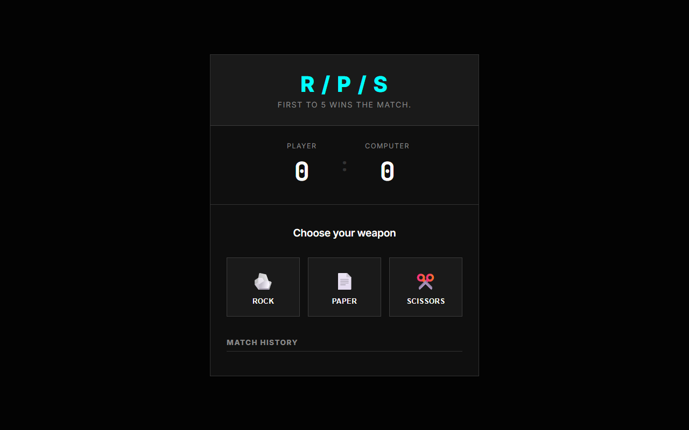

# Rock Paper Scissors

## Description
A modern take on the classic Rock-Paper-Scissors game, built with a high-contrast dark UI and a Cyan dopamine accent. It features a "first to 5" match format and a dynamic history log of previous moves.

## Live Demo
[Live Demo Link](https://ayushkumar563.github.io/rock-paper-scissors/) *(Deployed on GitHub Pages)*

## Tech Stack
- **HTML5**
- **CSS3** (CSS Grid/Flexbox, Custom Modal Overlays, Tactile Brutalism)
- **JavaScript (ES6)** (Game Logic, DOM Manipulation, Score Tracking)

## Features
- "First to 5" match system.
- Real-time scoreboard.
- Scrolling match history logging every move.
- Dynamic modal overlay upon match completion.

## How to Open / Run
1. Clone or download this repository.
2. Navigate to the directory.
3. Open `index.html` in your web browser. No server required.
